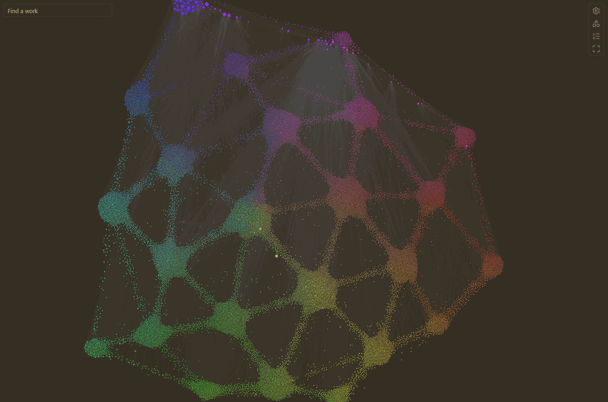
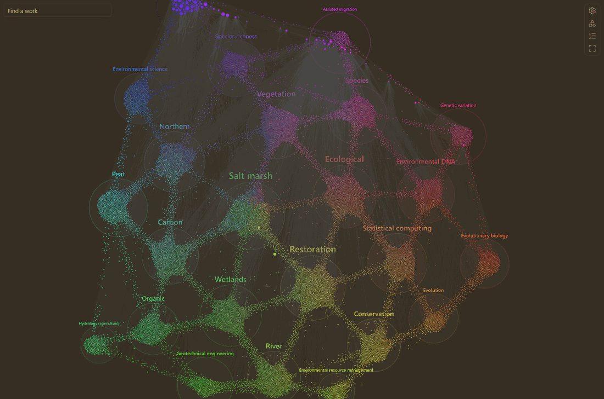
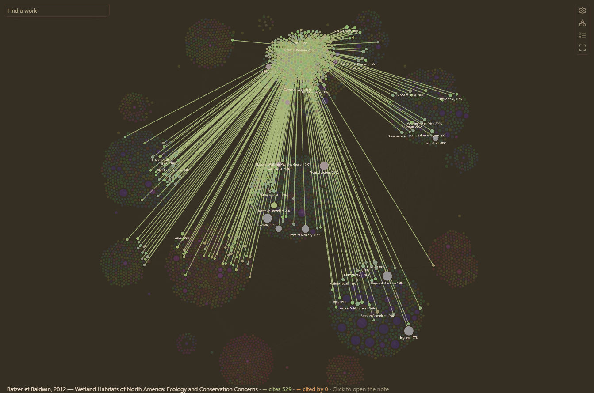
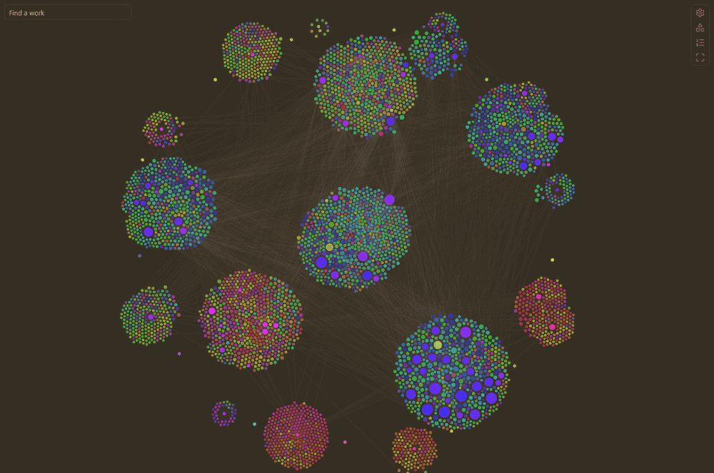
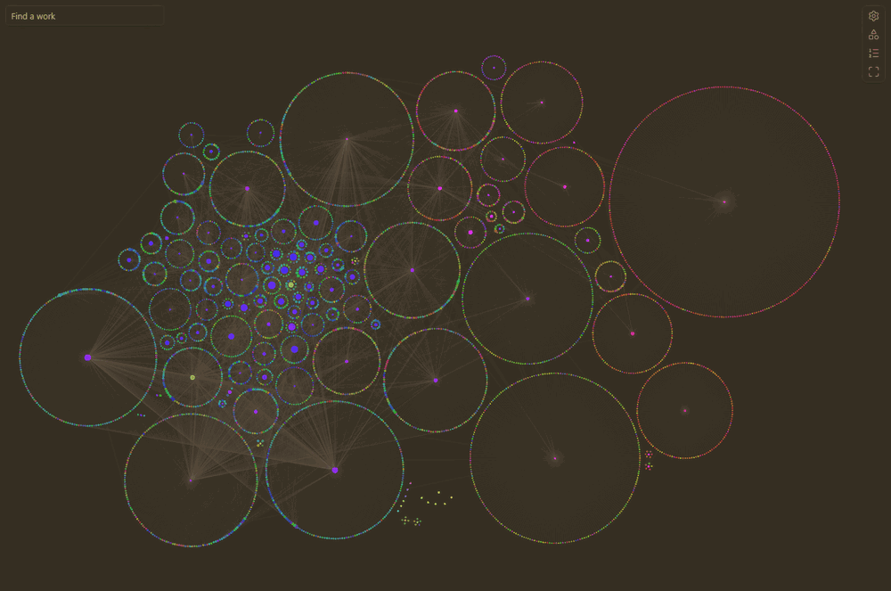
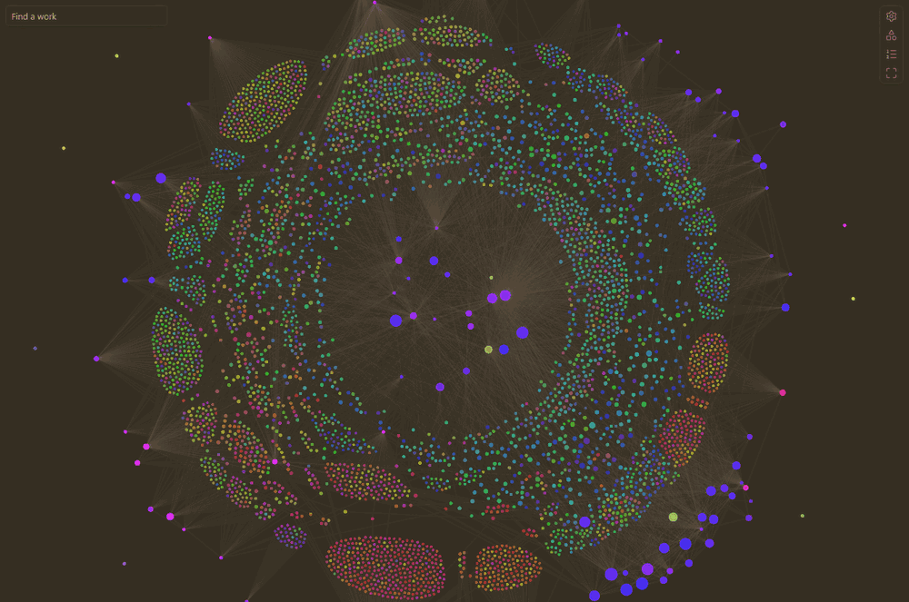
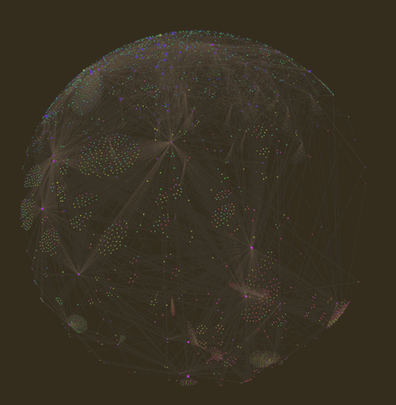
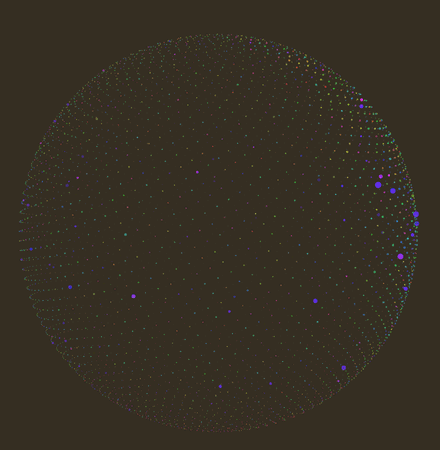
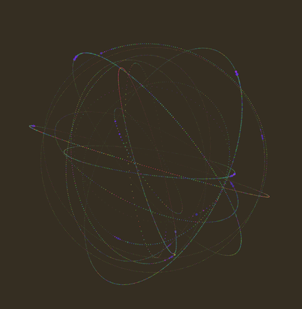
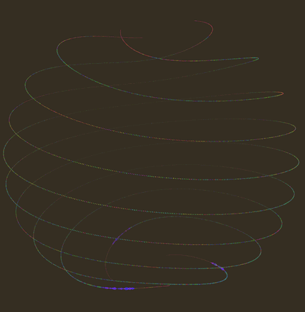

# Literature Graph

An Obsidian plugin for literature notes written in Markdown (for example, papers converted from PDF).

Explore how the works of your vault cite each other, and the works outside it that they cite, in a panel and a graph view of their own, built from the reference lists of your notes, from citation links and from OpenAlex.



*About 20,000 works: 112 literature notes and the works they cite, colored and placed by what they are about (the **Meaning** layout). Works of one meaning gather in a ball; works between two meanings form bridges between their balls.*



*The same graph with **Regions** on: each group of meaning named by the term most typical of its works.*

| Hover a work to see what it cites | Islands: communities of citations |
|---|---|
|  |  |
| **Atom graph**: each note with the works it cites around it | **Layers**: the vault in the middle, then each depth |
|  |  |

When you leave it alone, the graph turns into an animation:

| Rotating sphere | Globe | Orbits | Braid |
|---|---|---|---|
|  |  |  |  |

## Features

- **Literature graph.** A graph view of the citations between your literature notes, and optionally the works outside your vault they cite (with or without a DOI), in the style of Obsidian's graph view; also as a local graph around the active note, following the works it cites, the works citing it, or both.
- **Citations panel.** The works a note cites and the notes that cite it, on two levels, including the reference lists of papers converted from PDF.
- **Reference lists read from your notes**, even when the conversion damaged them, and linked to the notes of your vault.
- **Bibliographic data from OpenAlex**, cached for offline use (network access can be turned off).

Literature Graph works on its own. With [Better Citations](https://github.com/lavemile02-afk/Better_Citations_for_Obsidian), you can also cite a passage of a note with a link that opens it exactly there, and these links become citations in the graph (see [Citation links](#citation-links)).

## Installation

The plugin is not yet in Obsidian's community plugin directory. Download `main.js`, `manifest.json` and `styles.css` from the [latest release](https://github.com/lavemile02-afk/Literature-Graph-for-Obsidian/releases/latest), put them in `<vault>/.obsidian/plugins/literature-graph/`, then enable **Literature Graph** in **Settings → Community plugins**. It requires Obsidian 1.13.7 or later, on desktop.

Then, in the plugin settings, choose the **literature folder** (the folder of your literature notes; `Literature` by default) and the **citation language** of the labels, and check the names of the properties that hold each work's citation text, authors, year, title and DOI (by default `citation-text`, `authors`, `year`, `title` and `doi`; the case does not matter, as in Obsidian: `DOI` works too).

## Citation links

A citation link is an ordinary Markdown link whose text is the citation and whose URL points to a note (and a passage in it), as written by [Better Citations](https://github.com/lavemile02-afk/Better_Citations_for_Obsidian):

```markdown
([Bourgeois et al., 2016](obsidian://cite?note=Bourgeois%20et%20al.%2C%202016&q=Once%20canopy%20cover%20passed%20a%20threshold))
```

Literature Graph reads these links in every note, with or without Better Citations, and counts each as a citation of the linked work (by its `note`, or by its `doi` for a work outside your vault): they are edges of the graph and entries of the citations panel. Because they are URLs, Obsidian does not treat them as internal links, so they stay out of its own graph view and backlinks.

With Better Citations installed, a cited passage listed in the citations panel opens at the passage, and hover previews of works cited by DOI only show their title from Literature Graph's OpenAlex data; without it, the panel opens the cited work at the beginning of its note.

## Citations panel

**Open citations panel** (command or ribbon icon) shows, in the right sidebar, for the active note:

- **Cites**: the works it cites, with how many times each is cited. A work of your vault opens at the beginning of its note; a work outside your vault, cited by DOI, opens `https://doi.org/…`; a broken link is shown in red. Expand a work to see the cited passages; click one to open it.
- **Cited by**: the notes that cite it. Expand one to see the lines of its citations; click one to go there.
Each work expands to a second level: its cited passages, its own **References** and the works that **cite it** (the 50 most cited, with the total), from your vault's citation links and from OpenAlex, loaded when you open them. Works cited only by DOI show their title from OpenAlex.

- **References (OpenAlex)**: when the note has a DOI (its DOI property, or else the first `doi.org` link in it), the works that this work cites, from OpenAlex. Works of your vault (matched by DOI) open their note; the others open their DOI.

### Reference lists of converted papers

Literature notes converted from PDF usually end with their reference list ("References", "Literature cited", "Références bibliographiques"…; a book may have one per chapter). The plugin reads these lists, without changing the notes, and links each entry to a note of your vault when it can: by DOI, or else by first author and year **and** most of the title's words (or, without a title, the same author list), so that two works of the same author and year are not confused. An entry that matches no note, or more than one, is not linked. The note's aliases count as other titles: put the original title of a translation there, and the entries citing the original find it. Reference lists damaged by the conversion are read as far as possible (entries broken over two lines, missing headings, escaped or cut DOIs).

- **References (from the note)**: the entries of the active note's reference list, linked when possible (open by default when the note has no DOI).
- **Cited by** also lists the notes whose reference list cites the active note.

The notes' properties give the authors, year and title of each work (see the settings), and only notes in the literature folder are read this way.

## Literature graph

**Open graph** (command or ribbon icon) opens a graph view of your literature: the notes of the literature folder, and the citations between them, never wikilinks, so Obsidian's own graph view stays as it is. A citation between two works of your vault is drawn when it is found in a citation link, in the citing note's reference list, or in OpenAlex (the references of works with a DOI). Arrows point to the cited work, and larger nodes are cited more often.

**Local graph.** **Open local graph** shows, in the right sidebar, the works around the active note, up to one to three citations away (the **Local depth** slider), and follows the note you open. **Direction** chooses what it follows: the works the note cites (links), the works citing it (backlinks), or both. A note outside the literature folder, such as a draft that cites works with citation links, is shown at the center with the works it cites.

**Depth.** By default the graph shows the works of your vault (depth 0). With depth 1, it also shows, smaller and darker, the works outside your vault that they cite; with depth 2, the works those cite. These come from OpenAlex, and, for depth 1, also from the reference lists of your notes: works without a DOI (books, reports, older papers) are shown too, recognized from one note to another by first author, year and title, without any request (switch **Works without a DOI**). **Hide works without citations** hides the works that cite and are cited by none of the works shown. Since this can mean tens of thousands of works, a work outside the vault is shown only if enough works of the graph cite it (**Minimum citations**, by default at least one; the works of your vault are always shown, and the value set in the graph is kept), and the graph keeps at most a set number of works (by default 3000), the most cited first; the status line says how many were left out. Clicking a work outside the vault opens its ghost note (see below).

**"Cited By" graph.** Turned on in the graph's display panel (or in the plugin settings), depth 1 shows the other way round: the works outside your vault that **cite** the works of your vault, often newer than them, instead of the works they cite. OpenAlex lists them once (about one request per work of your vault, a few minutes for a large vault), and the list is kept in the cache. **Minimum citations** is then how many works of your vault a work cites: at 2, a work citing only one of yours is left out. A work is drawn larger the more of your works it cites.

**Colors.** The graph takes its colors from your theme. Works outside your vault are the notes' color blended with the background (darker on a dark theme, paler on a light one; depth 2 further), so the works you have stand out. When you hover a work, the arrows to the works it cites keep the accent color, and the arrows from the works citing it are orange; the line at the bottom left says how many of each. **Color of works outside the vault** and **Color of citing works**, in the settings, take any CSS color (empty: the theme's).

**Color by meaning.** In the graph's display panel (or the settings), **Color by: Meaning** colors every work by what it is about. Each work becomes a vector of meaning, by latent semantic analysis: the whole text of its note for a work of your vault (without its reference lists, whose authors and journals say little of its subject); its title, topics, keywords and abstract on OpenAlex for a work outside it; its reference for the others. The words are weighted by rarity (TF-IDF), and the corpus is condensed to 64 dimensions of meaning (a truncated singular value decomposition), so works using the same words, or words that occur together, get close vectors. A work outside your vault, known only by a title and an abstract, also takes in the meaning of the works of your vault it is linked to by citation (those citing it, or those it cites in the "Cited By" graph): they say what it is cited for. The works are then laid on a map of meaning, a [UMAP](https://umap-learn.readthedocs.io/) map, which keeps each work next to the works most alike in meaning (of each work's ten nearest works in meaning, 27 % stay among its ten nearest on the map, against 3 % on the plane of the two main directions used before), and a work's hue is its angle on that map, all around the color wheel. The map is learned once, on your literature notes and the works they cite (about 50 s for 10,000 works on a recent computer, a few minutes on a small laptop), turned to match the last map whenever it is learned again, and kept in the cache: later openings take about a second. The colors are therefore relative to the diversity of your literature: if all your works are on one field, their nuances get the whole wheel; add works from another domain and they take hues opposite to the rest. The meaning is learned from your literature notes and the works they cite, whatever the graph shows, so **a work keeps its color** from one opening to the next and in every graph (local graphs included); the colors move only when your notes change. Works outside your vault keep their hue, darker. Everything is computed on your computer, with no model to download; the keywords and abstracts of the works outside your vault are fetched once from OpenAlex, in batches of 50, and cached. The panel lists the main OpenAlex topics of the graph with the color of their works; **Meaning brightness** and **Meaning intensity**, in the settings, adjust the colors to your theme. **Keywords in your notes.** The command **Write keywords to notes** writes OpenAlex's keywords (about fifteen per work, most relevant first) into a property of your literature notes (**Keywords property** in the settings, `keywords` by default), but only where that property is empty: keywords already there are never replaced. You can edit them freely; color groups can use them (`[keywords:…]`). This command is the only one that writes into your literature notes, and only that property.

**Color groups.** As in Obsidian's graph view, notes can be colored by groups. In the graph's settings panel, **New group** opens a menu: pick a tag, a property's value (for example Type, then Book) or a folder from lists taken from your literature notes, and the group is created with its query; or type the query yourself, with suggestions (tags after `tag:`, properties after `[`, their values after `[Type:`, folders after `path:`). Groups are saved in the plugin settings, where they can also be written one per line as `query = color`; a note takes the color of the first group it matches:

```
tag:#review = #d9a441
[Type:Book] = rgb(120, 170, 220)
path:Theses = hsl(140, 40%, 55%)
```

Queries are `tag:#name` (nested tags included), `path:text`, `file:text`, `[property:value]` (the property contains the value), `[property]` (the property is not empty), or plain text found in the note's name or title. Groups color the works of your vault only.

**All notes and sources of citations.** **All notes of the vault** also shows the notes outside the literature folder that cite works with citation links (drafts, course notes), and the notes they cite that way; only citation links count, never wikilinks. **Citations from** chooses where the citations drawn are found: citation links, reference lists, OpenAlex. With citation links alone, the graph shows only the citations made to a passage.

**Finding a work.** The field at the top left, **Find a work**, suggests the works of the graph matching what you type (authors, year, words of the title, in any order); choosing one moves the view to it and highlights it.

**Idle animations.** When **Idle animations** is on in the settings, after a while without any click in Obsidian (**Idle delay**, 10 s by default; moving the mouse or typing does not count), the graph turns into an animation, chosen in the graph's display panel (or the plugin settings) and kept for every graph: a rotating sphere (with the citation lines), a free drift where every work floats on its own, a scanning globe, orbits (the works cited by one work of your vault share an orbit), a wave, twisting bands, a braid, a ribbon, or a constellation where signals run along the citations; or **Random animation**, a different one each time. Except in the sphere and the constellation, the lines fade out while it plays. The works can appear one by one: those of your vault first, then the others, oldest first. While it plays, the wheel zooms and hovering a work highlights it and its citations; a click on the graph brings the flat graph back (clicks in its panels and buttons do not). Several of these animations are adapted from [thinking-orbs](https://github.com/Jakubantalik/thinking-orbs) by Jakub Antalik (MIT). **Timeline**, in the graph's panel, shows only the works published up to a year, and its play button runs through the years.

**Controls.** The buttons in a column along the right edge of the graph open, to their left: the **settings panel**, which chooses the works shown (filter by author, year or title, depth, sources of citations, minimum citations, kept for every graph), the color groups and the forces of the layout; and the **display panel**, which changes how the graph looks: the style of layout, its regions and its meaning attraction, the "Cited By" graph, the coloring, the **Point size** (kept), the timeline, **Reset layout** and the idle animation. The other two buttons open the reading suggestions and fit the graph to the view.

The view looks like Obsidian's graph view and follows your theme (it uses the same `--graph-*` colors). Drag the background to move, scroll to zoom, drag a node to move it, hover a node to highlight its neighbors, and click a node to open its note (Ctrl/Cmd-click: new tab), or the ghost note of a work outside your vault. Hovering a work shows, at the bottom left, its title and what a click opens; even a tiny node can be clicked within a few pixels. The gear button opens the settings panel (filter, depth and direction, depth, minimum citations, color groups, forces); it turns into a cross to close the panel, and a click outside the panel closes it too. The graph fits itself to the view while it lays out, until you move or zoom; the **Fit** button (or a double click on the background) fits it again. Where labels would cover one another, only the most important are shown (the hovered work, then the works of your vault, then the most cited).

**Layout styles.** **Default graph**: every work repels the others, as in Obsidian's graph view. **Atom graph**: each work of your vault is a nucleus, alone at the center of a circle of the works outside your vault that it cites, like electrons (depth 1 on a circle, depth 2 on a larger one; the more works, the larger the circle); a work cited by several works of your vault goes to the smallest of their atoms; atoms never overlap, and citations between works of your vault keep their atoms side by side. **Chronological**: the works from left to right by year of publication, with the decades in large print above the graph, growing and shrinking with the zoom; the works are drawn larger, to be seen when the whole timeline is in view, and only the citation lines of the work under the pointer are drawn; the width is shared by rank of year, so each stretch holds as many works (a few very old works do not take most of the width), and works of unknown year stand in a column at the right. **Islands**: the communities of citations (works that cite one another a lot, found with the Louvain method) become islands, the largest in the middle; citations between islands barely pull. **Layers**: the works of your vault in the middle, then a ring for each depth. **Circle**: the works of your vault on a circle, oldest at the top then clockwise, their citations as chords across it, and the other works around. **Meaning**: the works are grouped by meaning (so by color), and each group gathers in a ball, near the balls of neighbor colors; a work between two meanings goes between their balls, as much as it resembles each, so the balls are joined by bridges of works in between, like a network of neurons. **Meaning attraction** (graph panel and settings) makes the groups more decided: higher, the balls are denser and the bridges thinner. **Center force** draws the whole graph towards the middle, for a large graph that does not fit the view. **Regions** (display panel, in this layout only; off whenever the graph opens) draws a circle around each group, of its color, with its name: the keyword nearest to the group's center of meaning (the mean of its works' vectors), shared by many of its works and nearer to it than to the other groups, such as "Peatland restoration" or "Methanogenic archaea"; below, smaller, the OpenAlex topic over-represented in the group, and its most typical terms (frequent in it and rare elsewhere, the class-based TF-IDF of BERTopic). Works without any text stay near the works they are linked to. **Meaning tree**: the semantic tree of the works, as TMAP draws it: each work is joined to the works most alike it, and only the links of the minimum spanning tree of these links are kept and drawn, so works of one subject line up in branches and twigs, and neighbor subjects grow from neighbor branches; the citations are drawn only for the work under the pointer. Choose the style in the graph's panel (**Layout**), or its default in the settings.

**The graph keeps its shape.** When the layout comes to rest, the place of each work is saved (in the plugin folder); at the next opening, the works move for a few seconds and settle back in their places, so the map of your literature stays the same. **Restart layout** starts the layout again from the current places.

The layout runs in a background thread (a web worker), and the view draws only when something moves, so even a graph of a few thousand works stays smooth and costs nothing once still, or while its tab is hidden.

### Duplicate works

When another note of the literature folder seems to be the same work as the active note (same DOI, or same first author, year and title), the citations panel says so under its title, with a link to the other note. **Find duplicate works** lists every such group. Notes with different DOIs, such as the two parts of a study, are never taken for one work.

### Reading suggestions

The list button at the right edge of the graph (or the command **Open reading suggestions**) opens, at the left of the view, the works outside your vault of the graph shown, most relevant first. Hover a work to highlight it in the graph and see why it is suggested; click it to open its ghost note (see below). The score is a plain sum, so that it can be explained: 1 for each work of your vault that cites it, then smaller amounts for the works of your vault it cites, the other works of the graph citing it, how often it is cited along with the works your vault cites most, how recent it is, and how often it is cited in all (OpenAlex).

The tab **Citing your works** turns the list around: the works outside your vault that cite the most works of your vault, first those citing the most (then, slightly, the most recent and the most cited), whether the graph shows them or not; it is what the cited-by graph draws. OpenAlex lists them the first time the tab is opened, then they come from the cache; **List again** asks again, to find the works published since.

The tab **Not on OpenAlex** keeps only the works OpenAlex does not know, most relevant first, each with its reference as written in your notes, a button to copy it and one to search for it on Google Scholar: a to-do list of sources to find by hand. A reference-list entry whose DOI OpenAlex does not know (most often damaged by a PDF conversion) is one of them, named from the entry rather than by its broken DOI.

**Export reading suggestions** writes the 1000 most relevant works outside your vault (at depth 1, without node limit) to a [JSON Lines](https://jsonlines.org/) file, for AI agents and other programs: a first line describing the file and each field, then one work per line with its DOI, title, authors, year, score, the notes of your vault that cite it and the reasons for its score. **Reading suggestions file**, in the settings, sets where (a path in the vault, hidden folders included; by default `reading-suggestions.jsonl` in the plugin folder). The file is written only by this command.

### Works outside the vault: ghost notes

Clicking a work outside your vault opens, in a new tab, its *ghost note*: what its note would look like, with its properties already filled from OpenAlex (title, authors, year, type, journal, volume, issue, pages, publisher, DOI, language, in-text citation and APA 7 reference) and its abstract. It is not a file. You can edit its properties and write in it: what you write is kept in `ghost-notes.json`, in the plugin folder, shown again the next time you open it, and counted in the work's meaning (see **Color by meaning**); **Discard changes** fills it from OpenAlex again. Only **Create note** creates the note, in the literature folder, named after its in-text citation (for example `Smith et al., 2020.md`), with what you wrote, and opens it in its place. A work known only from a reference list gets that entry as its reference.

**Note template** (settings) sets what the note contains, with fields such as `{{title}}`, `{{citationText}}`, `{{citation}}`, `{{authors}}`, `{{year}}`, `{{type}}`, `{{journal}}`, `{{volume}}`, `{{issue}}`, `{{pages}}`, `{{publisher}}`, `{{issn}}`, `{{doi}}`, `{{url}}`, `{{language}}`, `{{abstract}}`, `{{topics}}` and `{{keywords}}`. In a property line such as `Journal: "{{journal}}"`, an unknown value leaves the property empty; `Keywords: {{keywords}}` (or `{{topics}}`) becomes a list of the work's keywords (or topics) on OpenAlex, or an empty property when there are none, so every note has the same properties. Left empty, a simple template is used, with the property names of the settings (keywords included). Titles are kept as OpenAlex gives them, often in title case: check them against APA's sentence case.

**Download PDF** appears only when OpenAlex knows a free PDF of the work; the PDF is saved in your vault, in the **PDF folder** of the settings (by default where Obsidian puts attachments), named like the note. When the free version is a web page rather than a PDF, it opens in your browser (**Read for free**). Works that OpenAlex no longer has (merged or deleted), but that other works still list among their references, are left out of the graph.

## Network use

When **Use OpenAlex** is on (the default), the plugin sends requests to [OpenAlex](https://openalex.org) (`api.openalex.org`), a free and open index of scholarly works, to get bibliographic data: the requests contain DOIs and OpenAlex work ids only (a ghost note fetches its work's details once, a free request), plus the contact email if you set one in the settings. Downloading a PDF from a ghost note requests it from the site OpenAlex points to. Answers are cached in `openalex-cache.json` in the plugin folder, so they stay available offline and each work is requested only once. Turn **Use OpenAlex** off to make no network requests at all; the cache is still used.

Without an API key, OpenAlex allows each network (IP address) a free budget of $0.10 of usage a day, renewed at midnight UTC; the plugin fetches works by DOI or id in batches of 50, at $0.0001 per batch, so a few hundred works cost well under a cent, but a first large depth-2 graph, or other programs on the same network, can still use it up. When OpenAlex refuses requests, the plugin says so once, stops asking until the budget is back, and keeps using what is cached. A free API key (see [openalex.org](https://openalex.org)) has its own budget, ten times larger ($1 a day): store it with **OpenAlex API key** in the settings, which keeps it in Obsidian's secret storage rather than in the plugin's settings file.

## Privacy and permissions

What the plugin reads, writes and runs, as Obsidian's automatic review lists it:

- **Reading the vault (vault enumeration).** The plugin lists the Markdown notes of the vault and reads them through Obsidian's API to build its citation index: every note for its citation links, and the notes of the literature folder also for their properties, their reference lists and, for the colors by meaning, their words. Nothing leaves your computer except the requests described above.
- **Writing.** Only in your vault, through Obsidian's API, and only when you ask: the note of a work outside the vault (**Create note** in its ghost note), its PDF (**Download PDF**, in the **PDF folder**), the keywords property of your literature notes where it is empty (**Write keywords to notes**), and the reading suggestions file (**Export reading suggestions**). In its own folder (`.obsidian/plugins/literature-graph/`), the plugin keeps its settings and caches: `openalex-cache.json` (what OpenAlex answered), `layout-positions.json` (where the works were), `ghost-notes.json` (what you wrote in ghost notes) and `meaning-cache.json` (the places of the works in the plane of meaning).
- **Clipboard.** The plugin writes to the clipboard only when you click **Copy the reference** of a work in the reading suggestions; it never reads the clipboard.
- **Dynamic code execution.** The plugin's own code never builds or evaluates code. The review finds `new Function` in [PixiJS](https://pixijs.com/), the library that draws the graph: a one-time test of whether the environment allows it. The layout of the graph runs in a web worker created from code bundled in `main.js` (a `Blob`), not from anything downloaded.
- **No telemetry**, no account, no advertising.

## Development

Requires [Node.js](https://nodejs.org/) (current LTS) and npm.

```bash
npm install      # install dependencies
npm run dev      # rebuild main.js on every change (watch mode)
npm run build    # type-check and build a production main.js
npm run lint     # lint with the Obsidian ESLint rules
npm test         # run the tests (Node's built-in test runner)
```

The source is in `src/` (TypeScript). The build writes `main.js` at the repository root. To test in a vault, copy `main.js`, `manifest.json` and `styles.css` into `<vault>/.obsidian/plugins/literature-graph/` and reload the plugin.

The rendering uses [PixiJS](https://pixijs.com) and [d3-force](https://d3js.org/d3-force), bundled into `main.js`. After changing dependencies, run `npm run notices` to update `THIRD-PARTY-NOTICES.md`, which holds the licenses of every bundled package.

The project structure follows the official [Obsidian sample plugin](https://github.com/obsidianmd/obsidian-sample-plugin).

### Releasing

Run `npm version <x.y.z>` (updates `manifest.json` and `versions.json`), then push the commit and the tag. A GitHub Action builds the plugin and creates the release with `main.js`, `manifest.json` and `styles.css`.

## License

[MIT](LICENSE)
